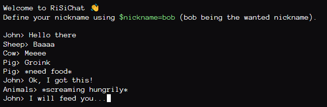

# Ridiculously Simple Chat
RiSiChat (or RSC for close friends) is a basic chat system without login, without message saving, without anything other than a text chat with possibility to change your nickname. It was created in order to have fun while we were bored but it can be used for confidential talks as long as you put a secure way to get HTTPS with nginx, Apache or your prefered HTTP server. You can also change the code to add an HTTP secure or HTTP/2 option (or QUIC if you're tough enough)!

Its lack of functionnalities make it simple but non-transparent, don't use it for commercial purpose, this software cannot provide any saves as it doesn't even has a database.

# Demo
You can use a demo at [chat.qtmsheep.com](https://chat.qtmsheep.com). Or just look at this screenshot from John:

# Contribute
You want to contribute to the project? Ok, go ahead! I'll accept any pull request that seems reasonable or useful (or not) to the project.
